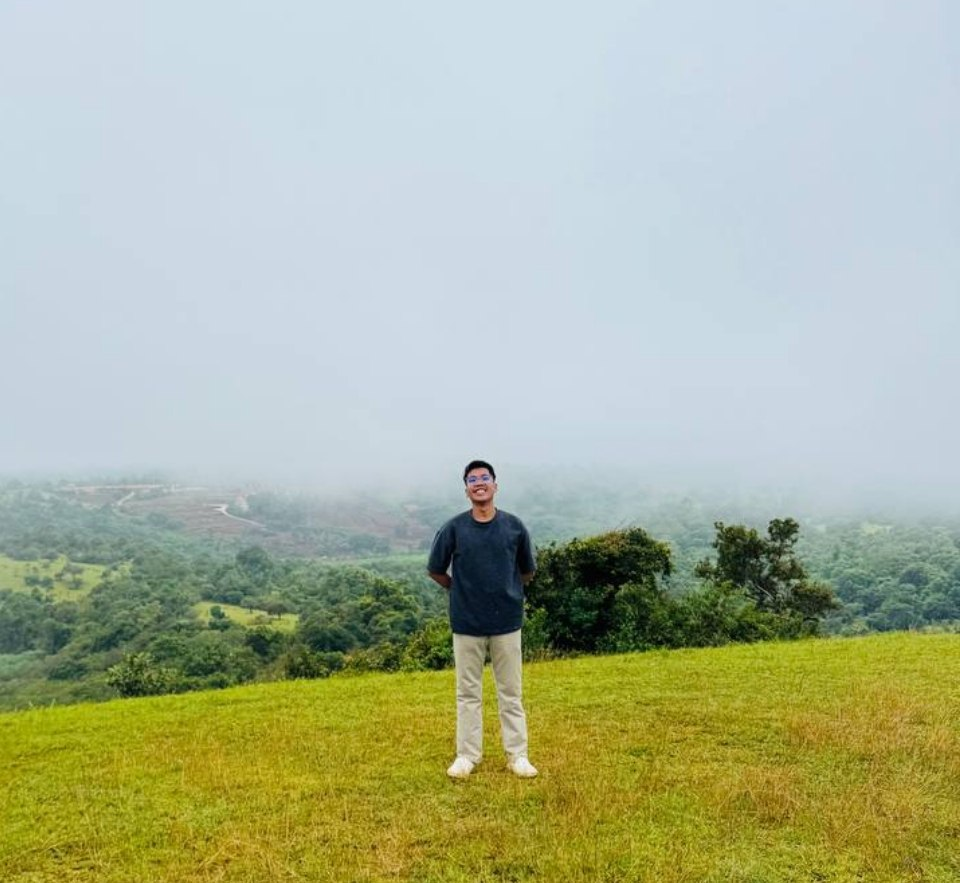

# Khut Sopheaktra — Developer Portfolio

A personal portfolio website built with **Vue 3** and a bold **Neo-Brutalist** design system — thick borders, hard offset shadows, and bright contrasting colors.

🔗 **Live site:** [khutsopheaktra51.github.io/portfolio](https://khutsopheaktra51.github.io/portfolio/)

---

## About

I'm a university Computer Science student based in Phnom Penh, Cambodia, passionate about backend development, modern frontend technologies, and turning ideas into real-world applications. This portfolio showcases my projects, skills, and journey as an aspiring software developer.

---

## Tech Stack

- **Framework:** Vue 3 (Composition API, `<script setup>`)
- **Build Tool:** Vite
- **Styling:** Tailwind CSS
- **Icons:** Lucide Icons (`lucide-vue-next`)
- **Deployment:** GitHub Pages via GitHub Actions

---

## Features

- Bold Neo-Brutalist UI — thick borders, hard shadows, high-contrast colors
- Fully responsive (mobile, tablet, desktop)
- Sections: Hero, About, Tech Stack, Projects, Experience/Journey, Contact
- Reusable Vue components with data separated into `src/data/*.js` files
- Contact form with client-side validation (uses `mailto:` — no backend required)
- Downloadable CV/resume
- Accessible: semantic HTML, alt text, keyboard-friendly navigation
- Respects `prefers-reduced-motion` for animations
- Auto-deploys to GitHub Pages on every push to `main`

---

## Project Structure
